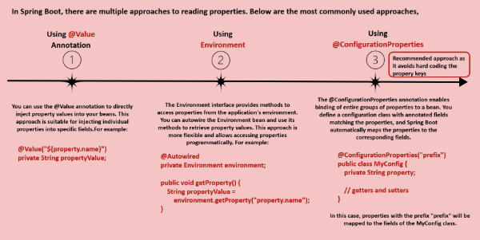
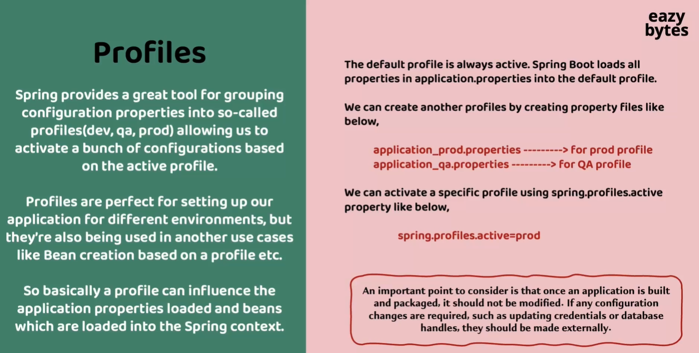
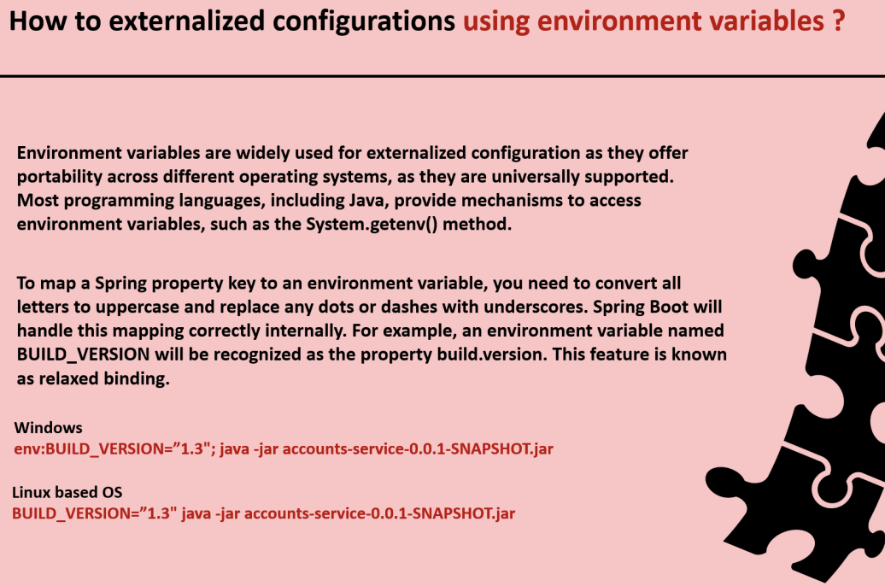
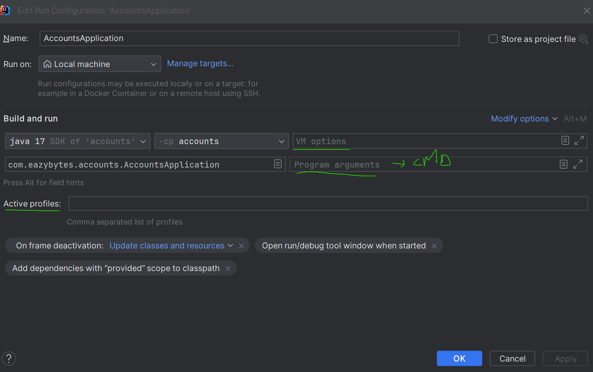

# Configuration in Microservices

### Priority of Configurations in SpringBoot


### Different ways to Access Configuration properties


Mapping to Bean - Way Three
---------------
#### Read multiple properties by mapping to a record
1. Define the properties in properties file
   ``` properties
   accounts:
    message: "Welcome to EazyBank accounts related local APIs "
    contactDetails:
        name: "John Doe - Developer"
        email: "john@eazybank.com"
    onCallSupport:
        - (555) 555-1234
        - (555) 523-1345
   ```
2. Define Dto Bean 
   ```java
   package com.eazybytes.accounts.dto;
   
   import org.springframework.boot.context.properties.ConfigurationProperties;
   
   import java.util.List;
   import java.util.Map;
   
   @ConfigurationProperties(prefix = "accounts")
   public record AccountsContactInfoDto(String message, Map<String, String> contactDetails, List<String> onCallSupport) {
   
   }            
      
   ```
3. Enable Configuration in SpringBootApplication
   ```java
   @EnableConfigurationProperties(value = {AccountsContactInfoDto.class})
   public class AccountsApplication {
   
       public static void main(String[] args) {
           SpringApplication.run(AccountsApplication.class, args);
       }
   
   }
   
   ```
4. Read The properties by injecting
   ```java

    @Autowired
    private AccountsContactInfoDto accountsContactInfoDto;
    
    @GetMapping("/contact-info")
    public ResponseEntity<AccountsContactInfoDto> getContactInfo() {
        return ResponseEntity
                .status(HttpStatus.OK)
                .body(accountsContactInfoDto);
    }
    ```
Profiles In Springboot
---------------------


Various Ways to pass configuration properties in SpringBoot
-----------------------------



    
Passing properties in IntellijIdea
--------------



